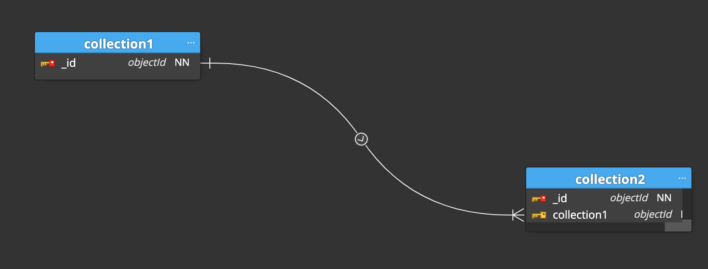

# modulo1-entrega

En este laboratorio lo que he hecho es:
  - Modelar la aplicación de cursos y videos.
  - He aplicado los siguiente patrones:
     ....

El modelo resultante es



Lo backups están en la siugiente carpeta, instrucciones para restaurar

```bash
```